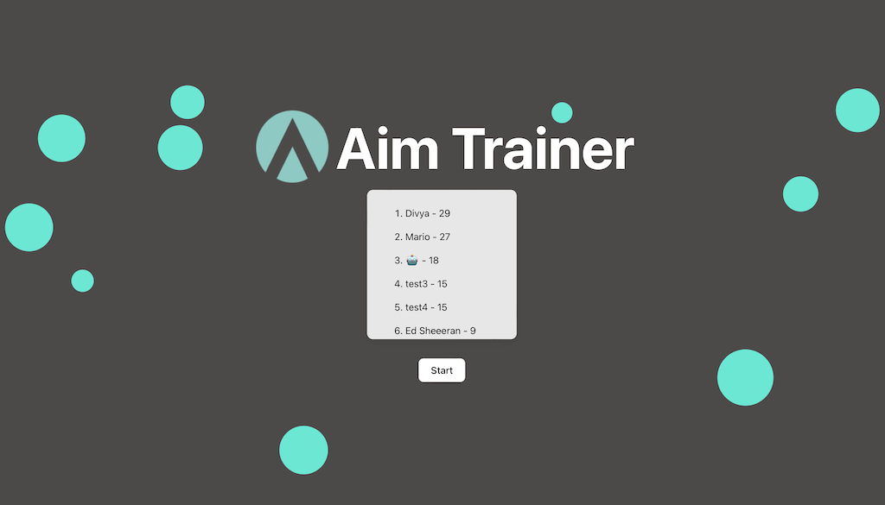

# Aim Trainer

Aim Trainer is an engaging circle clicker game designed to enhance your reflexes. This application primarily uses **React.js** as our framework for building the user interface and **node.js** for the server.

## Project Demo




## Project Description

Aim trainer was developed to test and train one's ability to aim properly. This web application consists of 3 pages -> home page, game page, and leaderboard page. The application uses the React Router library to handle navigation between these pages. Everytime the user click on a circle, a sound (retro laser shooter) is emitted. There is a leaderboard to keep track of points as well.

**Technologies Used:** React.js, node.js, express.js

## Design Phase

During the design phase of our project, we created a detailed design diagram using Figma. 


## How to Run

- Clone the repository
- Make sure that you have Node.js and npm (Node Package Manager) installed on your system
- cd to frontend
- Install the required dependencies by running the following in the terminal:

  ```
  npm install
  ```

  ```
  npm run dev
  ```

- This will start the development server and it is accessible the application in the web browser at as shown in the terminal
